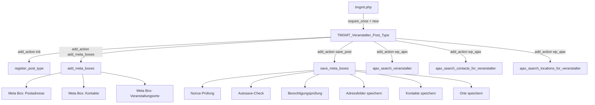
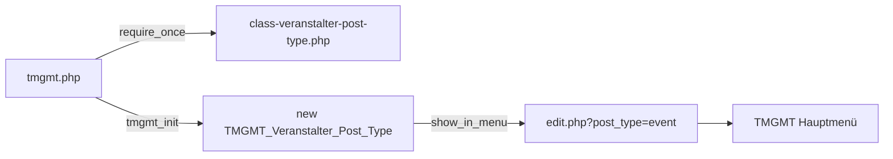

# Design-Dokument: Veranstalter CPT

## Übersicht

Der Veranstalter CPT (`tmgmt_veranstalter`) erweitert das TMGMT-Plugin um die Verwaltung von Organisationen und Vereinen, die als Auftraggeber für Gigs fungieren. Die Implementierung folgt dem bestehenden Architekturmuster der Post Types `tmgmt_contact` und `tmgmt_location` und integriert sich nahtlos in das Plugin-Menü unter `edit.php?post_type=event`.

Kernfunktionen:
- Registrierung eines nicht-öffentlichen CPT mit Admin-UI
- Postadresse mit Sanitization und Nonce-Schutz
- Kontaktzuordnung mit Rollen (Vertrag, Technik, Programm) via AJAX-Suche
- Verknüpfung mit Veranstaltungsorten (Ort_CPT) via AJAX-Suche
- AJAX-Suchendpunkt für externe Nutzung (z.B. Event-Bearbeitungsseite)

## Architektur

Das Feature folgt dem bestehenden Single-Class-Pattern der TMGMT Post Types. Eine einzelne Klasse `TMGMT_Veranstalter_Post_Type` kapselt die gesamte Logik: CPT-Registrierung, Meta-Boxen, Speicherung und AJAX-Handler.



### Einbindung in das Plugin



Die Datei `includes/post-types/class-veranstalter-post-type.php` wird in `tmgmt.php` per `require_once` eingebunden. In `tmgmt_init()` wird die Klasse instanziiert, analog zu `TMGMT_Location_Post_Type` und `TMGMT_Contact_Post_Type`.

## Komponenten und Schnittstellen

### Klasse: `TMGMT_Veranstalter_Post_Type`

**Datei:** `includes/post-types/class-veranstalter-post-type.php`

#### Konstruktor-Hooks

| Hook | Callback | Beschreibung |
|------|----------|-------------|
| `init` | `register_post_type` | CPT-Registrierung |
| `add_meta_boxes` | `add_meta_boxes` | Meta-Boxen hinzufügen |
| `save_post` | `save_meta_boxes` | Meta-Daten speichern |
| `wp_insert_post_data` | `force_publish_status` | Entwurf-Modus deaktivieren |
| `wp_ajax_tmgmt_search_veranstalter` | `ajax_search_veranstalter` | Veranstalter-Suche |
| `wp_ajax_tmgmt_search_contacts_for_veranstalter` | `ajax_search_contacts_for_veranstalter` | Kontakt-Suche innerhalb Veranstalter |
| `wp_ajax_tmgmt_search_locations_for_veranstalter` | `ajax_search_locations_for_veranstalter` | Ort-Suche innerhalb Veranstalter |
| `admin_notices` | `show_missing_contract_notice` | Hinweis bei fehlender Vertrag-Rolle |

#### Öffentliche Methoden

| Methode | Beschreibung |
|---------|-------------|
| `register_post_type()` | Registriert `tmgmt_veranstalter` mit Labels, `public => false`, `show_ui => true`, `show_in_menu => 'edit.php?post_type=event'`, `supports => ['title']`, `show_in_rest => false` |
| `add_meta_boxes()` | Fügt drei Meta-Boxen hinzu: Postadresse, Kontakte, Veranstaltungsorte |
| `render_address_box($post)` | Rendert Adressfelder (Straße, Hausnummer, PLZ, Ort, Land) |
| `render_contacts_box($post)` | Rendert Kontaktzuordnung mit Rollen-Dropdowns und AJAX-Suche |
| `render_locations_box($post)` | Rendert Ort-Zuordnung mit AJAX-Suche und Entfernen-Funktion |
| `save_meta_boxes($post_id)` | Speichert alle Meta-Daten mit Nonce-, Autosave- und Berechtigungsprüfung |
| `force_publish_status($data, $postarr)` | Erzwingt `post_status = 'publish'` (analog zu Event CPT) |
| `show_missing_contract_notice()` | Zeigt Admin-Hinweis wenn Vertrag-Rolle fehlt |
| `ajax_search_veranstalter()` | AJAX-Handler: Suche nach Veranstalter-Titel, gibt ID/Titel/Stadt zurück, max. 20 Ergebnisse |
| `ajax_search_contacts_for_veranstalter()` | AJAX-Handler: Suche nach Kontakten für Zuordnung |
| `ajax_search_locations_for_veranstalter()` | AJAX-Handler: Suche nach Orten für Zuordnung |

### AJAX-Endpunkte

| Action | Methode | Parameter | Rückgabe |
|--------|---------|-----------|----------|
| `tmgmt_search_veranstalter` | GET | `term` (string) | `{id, title, city}[]` (max. 20) |
| `tmgmt_search_contacts_for_veranstalter` | GET | `term` (string) | `{id, title, firstname, lastname, email}[]` |
| `tmgmt_search_locations_for_veranstalter` | GET | `term` (string) | `{id, title, city}[]` |

### Meta-Boxen

#### 1. Postadresse (`tmgmt_veranstalter_address`)
- Position: `normal`, Priorität: `high`
- Felder: Straße, Hausnummer, PLZ, Ort, Land
- Layout: `<table class="form-table">` (konsistent mit Location/Contact CPT)
- Nonce: `tmgmt_save_veranstalter_meta` / `tmgmt_veranstalter_meta_nonce`

#### 2. Kontakte (`tmgmt_veranstalter_contacts`)
- Position: `normal`, Priorität: `high`
- Pro Rolle (Vertrag, Technik, Programm): AJAX-Suchfeld + ausgewählter Kontakt-Anzeige
- Vertrag-Rolle: Pflichtfeld (visuell markiert)
- Technik/Programm: Optional
- Ein Kontakt kann mehrere Rollen gleichzeitig haben

#### 3. Veranstaltungsorte (`tmgmt_veranstalter_locations`)
- Position: `normal`, Priorität: `default`
- AJAX-Suchfeld zum Hinzufügen von Orten
- Liste der zugeordneten Orte mit Name und Stadt
- Entfernen-Button pro Ort

### Einbindung in tmgmt.php

```php
// In den require_once Block:
require_once TMGMT_PLUGIN_DIR . 'includes/post-types/class-veranstalter-post-type.php';

// In tmgmt_init():
new TMGMT_Veranstalter_Post_Type();
```

## Datenmodell

### Post Type Registrierung

```php
register_post_type('tmgmt_veranstalter', [
    'labels' => [...],           // Singular: "Veranstalter", Plural: "Veranstalter"
    'public' => false,
    'show_ui' => true,
    'show_in_menu' => 'edit.php?post_type=event',
    'supports' => ['title'],
    'show_in_rest' => false,
    'capability_type' => 'post',
    'has_archive' => false,
    'hierarchical' => false,
]);
```

### Meta-Keys

| Meta-Key | Typ | Beschreibung |
|----------|-----|-------------|
| `_tmgmt_veranstalter_street` | string | Straße |
| `_tmgmt_veranstalter_number` | string | Hausnummer |
| `_tmgmt_veranstalter_zip` | string | PLZ |
| `_tmgmt_veranstalter_city` | string | Ort |
| `_tmgmt_veranstalter_country` | string | Land |
| `_tmgmt_veranstalter_contacts` | serialized array | Kontaktzuordnungen mit Rollen |
| `_tmgmt_veranstalter_locations` | array | Array von Ort-IDs |

### Kontakte-Datenstruktur (`_tmgmt_veranstalter_contacts`)

```php
[
    [
        'contact_id' => 123,    // Post-ID des tmgmt_contact
        'role' => 'vertrag'     // 'vertrag' | 'technik' | 'programm'
    ],
    [
        'contact_id' => 456,
        'role' => 'technik'
    ],
    [
        'contact_id' => 123,    // Gleicher Kontakt, andere Rolle
        'role' => 'programm'
    ]
]
```

### Veranstaltungsorte-Datenstruktur (`_tmgmt_veranstalter_locations`)

```php
[101, 202, 303]  // Array von tmgmt_location Post-IDs
```

### Rollen-Definition

| Rolle | Slug | Pflicht | Beschreibung |
|-------|------|---------|-------------|
| Vertrag | `vertrag` | Ja (genau 1) | Primärer Ansprechpartner für Verträge |
| Technik | `technik` | Nein | Ansprechpartner für technische Belange |
| Programm | `programm` | Nein | Ansprechpartner vor Ort |


## Korrektheitseigenschaften

*Eine Korrektheitseigenschaft ist ein Merkmal oder Verhalten, das für alle gültigen Ausführungen eines Systems gelten sollte – im Wesentlichen eine formale Aussage darüber, was das System tun soll. Eigenschaften dienen als Brücke zwischen menschenlesbaren Spezifikationen und maschinenverifizierbaren Korrektheitsgarantien.*

### Property 1: Adressdaten Round-Trip

*Für beliebige* gültige Adressdaten (Straße, Hausnummer, PLZ, Ort, Land), wenn diese über `save_meta_boxes` gespeichert werden, dann sollte `get_post_meta` für jeden Schlüssel den gleichen (sanitisierten) Wert zurückgeben.

**Validates: Requirements 2.3, 2.4**

### Property 2: Sanitization-Invariante

*Für beliebige* Eingabestrings in den Adressfeldern, der gespeicherte Wert muss immer dem Ergebnis von `sanitize_text_field(input)` entsprechen. Insbesondere dürfen keine HTML-Tags oder unsicheren Zeichen im gespeicherten Wert enthalten sein.

**Validates: Requirements 2.5**

### Property 3: Kontaktzuordnung Round-Trip

*Für beliebige* gültige Kontaktzuordnungen (Arrays von `{contact_id, role}` Paaren, wobei ein Kontakt auch mehrere Rollen haben kann), wenn diese über `save_meta_boxes` gespeichert werden, dann sollte `get_post_meta('_tmgmt_veranstalter_contacts')` ein äquivalentes Array zurückgeben.

**Validates: Requirements 3.6, 3.7**

### Property 4: Vertrag-Rolle Validierung

*Für beliebige* Kontaktzuordnungen eines Veranstalters: die Validierung meldet genau dann einen Fehler, wenn kein Kontakt mit der Rolle `vertrag` zugeordnet ist. Zuordnungen ohne `technik`- oder `programm`-Rolle erzeugen keinen Fehler.

**Validates: Requirements 3.4, 3.5, 3.9**

### Property 5: Veranstaltungsorte Round-Trip

*Für beliebige* Arrays von gültigen Ort-IDs, wenn diese über `save_meta_boxes` gespeichert werden, dann sollte `get_post_meta('_tmgmt_veranstalter_locations')` das gleiche Array zurückgeben.

**Validates: Requirements 4.4**

### Property 6: Ort-Entfernung Invariante

*Für beliebige* Listen von zugeordneten Orten und einen zu entfernenden Ort: nach dem Entfernen sollte die resultierende Liste genau ein Element weniger enthalten und der entfernte Ort nicht mehr in der Liste vorhanden sein.

**Validates: Requirements 4.6**

### Property 7: Force-Publish Invariante

*Für beliebige* Post-Status-Werte (außer `trash` und `auto-draft`), wenn ein Veranstalter-Post gespeichert wird, dann muss der resultierende `post_status` immer `publish` sein.

**Validates: Requirements 5.5**

### Property 8: Veranstalter-Suche Ergebnisstruktur

*Für beliebige* Suchbegriffe und Veranstalter-Datenbestände: jedes Suchergebnis des AJAX-Endpunkts `tmgmt_search_veranstalter` muss die Felder `id`, `title` und `city` enthalten, und der Titel jedes Ergebnisses muss den Suchbegriff enthalten.

**Validates: Requirements 6.2, 6.3**

### Property 9: Suchergebnis-Limit

*Für beliebige* Datenbestände von Veranstaltern und beliebige Suchbegriffe: die Anzahl der zurückgegebenen Suchergebnisse darf niemals 20 überschreiten.

**Validates: Requirements 6.4**

### Property 10: Meta-Key Präfix Invariante

*Für alle* vom Veranstalter CPT gespeicherten Meta-Keys: jeder Key muss mit dem Präfix `_tmgmt_veranstalter_` beginnen.

**Validates: Requirements 7.4**

## Fehlerbehandlung

| Szenario | Verhalten | Implementierung |
|----------|-----------|----------------|
| Ungültige/fehlende Nonce | Speicherung wird abgebrochen, keine Daten geändert | `wp_verify_nonce()` Check am Anfang von `save_meta_boxes()` |
| Autosave aktiv | Meta-Daten werden nicht gespeichert | `DOING_AUTOSAVE` Check |
| Fehlende Berechtigung | Speicherung wird abgebrochen | `current_user_can('edit_post', $post_id)` Check |
| Fehlende Vertrag-Rolle | Admin-Hinweis (notice-warning) wird angezeigt, Post wird trotzdem gespeichert | `admin_notices` Hook mit Transient-basierter Meldung |
| AJAX-Suche ohne Berechtigung | JSON-Error-Response | `current_user_can('edit_posts')` Check |
| Leerer Suchbegriff | Leeres Ergebnis-Array | Leerer String wird an `WP_Query` übergeben |
| Ungültige Kontakt-ID in Zuordnung | Wird ignoriert beim Rendern (Post existiert nicht) | `get_post()` Prüfung beim Anzeigen |
| Ungültige Ort-ID in Zuordnung | Wird ignoriert beim Rendern | `get_post()` Prüfung beim Anzeigen |

## Teststrategie

### Property-Based Testing

**Bibliothek:** [Eris](https://github.com/giorgiosironi/eris) (PHP Property-Based Testing Library für PHPUnit)

Jeder Property-Test muss mindestens 100 Iterationen durchlaufen und mit einem Kommentar auf die Design-Property verweisen:

```php
// Feature: veranstalter-cpt, Property 1: Adressdaten Round-Trip
```

**Property-Tests:**

| Property | Test-Beschreibung | Generator |
|----------|-------------------|-----------|
| Property 1 | Zufällige Adressdaten speichern und laden | Zufällige Strings für Straße, Nr, PLZ, Ort, Land |
| Property 2 | Sanitization-Verhalten prüfen | Strings mit HTML-Tags, Sonderzeichen, Whitespace |
| Property 3 | Kontaktzuordnungen speichern und laden | Zufällige Arrays von {contact_id, role} Paaren |
| Property 4 | Validierung der Vertrag-Rolle | Zufällige Kontakt-Arrays mit/ohne Vertrag-Rolle |
| Property 5 | Ort-IDs speichern und laden | Zufällige Integer-Arrays |
| Property 6 | Ort aus Liste entfernen | Zufällige Ort-Listen + zufälliger Index zum Entfernen |
| Property 7 | Force-Publish bei verschiedenen Status | Zufällige Post-Status-Strings |
| Property 8 | Suchergebnis-Struktur prüfen | Zufällige Suchbegriffe + Veranstalter-Daten |
| Property 9 | Suchergebnis-Limit prüfen | Große Datenmengen + Suchbegriffe |
| Property 10 | Meta-Key Präfix prüfen | Alle definierten Meta-Keys der Klasse |

### Unit-Tests

Unit-Tests ergänzen die Property-Tests für spezifische Beispiele und Edge-Cases:

- CPT-Registrierung: Labels, Argumente, Menü-Position (Anforderung 1.1-1.5)
- Nonce-Prüfung: Speicherung ohne Nonce wird abgelehnt (Anforderung 2.6, 5.1)
- Autosave-Check: Meta-Daten werden bei Autosave nicht gespeichert (Anforderung 5.2)
- Berechtigungsprüfung: Speicherung ohne Berechtigung wird abgelehnt (Anforderung 5.3, 6.5)
- Rollen-Definition: Genau drei Rollen (vertrag, technik, programm) sind definiert (Anforderung 3.3)
- AJAX-Endpunkt-Registrierung: Action-Hooks sind korrekt registriert (Anforderung 6.1)

### Playwright E2E-Tests

Ergänzend zu den PHP-Tests können Playwright-Tests die UI-Integration prüfen:

- Meta-Box-Rendering auf der Bearbeitungsseite
- AJAX-Suche in den Kontakt- und Ort-Feldern
- Admin-Hinweis bei fehlender Vertrag-Rolle
- Menü-Integration im TMGMT-Hauptmenü
